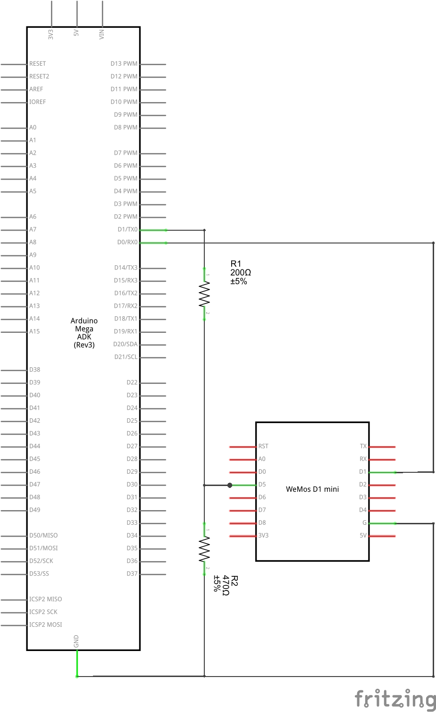

[Homie](https://github.com/marvinroger/homie) based bridge MQTT to [RFLink module](http://www.nemcon.nl/blog2)

Forked from https://github.com/enc-X/mqtt-rflink-bridge and updated to compile with Homie v2.0

## Features:
* MQTT Bridge for RFLink:
  -publish via MQTT in JSON format messages received from RFlink gateway
  -send to RFlink gateway messages received via MQTT
* All Homie built-in features (OTA,configuration)

## Limitations
  * Messages that are too long (mostly debug) may not be published - error message will be published

## Requirements
- RFLink (Basically, an ATMega with 433 MHz Receiver/Transmitter)  http://www.nemcon.nl/blog2
- ESP8266 (WeMos D1 suggested)
- 4 Dupont wires

## Installation
- Install PlatformIO (core) for your OS. (http://docs.platformio.org/en/latest/installation.html)
- Clone this repository and change to the directory.
- Connect your ESP device
- run platformio run --target upload. It should download a lot of dependencies and then compile
- Configure your network by first visiting http://marvinroger.github.io/homie-esp8266/configurators/v2/ and then connecting to the WiFi network your ESP set up (Homie-xxxxxx).

Notes
- If you have a different ESP board, create another Env entry in platform.ini and verify the pin numbers in the sketch.
- The configurator did not work under Mac OS X High Sierra Safari, I had to use Chrome.

## Connections

* Perform standard [RFlink wiring] (http://www.nemcon.nl/blog2/wiring)
* Connect RFLink to ESP8266
  * Arduino MEGA TX (D1) to ESP8266 Soft Serial RX (GPIO14 / D5 on wemos D1 mini). 
  * Arduino MEGA RX (D0) to ESP8266 Soft Serial TX (GPIO5 / D1 on WeMos D1 mini )
  * Arduino MEGA 3.3v to ESP vcc
  * Arduino MEGA ground to ESP ground
  
The IO pins of the ESP are 5v tolerant as per communication of the Espressif CEO. If you don't want to take chances, or experience issues, use a logic level shifter 5V->3,3V or voltage divider (use 200Ohm and 470Ohm resistors).
Do NOT feed 5v to ESP vcc.
If you power the ESP and the Mega independently, do not connect VCC but do connect ground.

## schematic


## MQTT messages

<table>
<tr>
  <th>Property</th>
  <th>Message format</th>
  <th>Direction</th>
  <th>Description</th>
</tr>
<tr>
  <td>_HOMIE_PREFIX_/_node-id_/serial01/to-send/set</td>
  <td>See [RFlink protocol reference](http://www.nemcon.nl/blog2/protref) </td>
  <td>Controller → Device</td>
  <td></td>
</tr>
<tr>
  <td>_HOMIE_PREFIX_/_node-id_/serial01/publish-mode/set</td>
  <td>(RAW|JSON|STANDARD)</td>
  <td>Controller → Device</td>
  <td>Set publishing methods</td>
</tr>
<tr>
  <td>_HOMIE_PREFIX_/_node-id_/serial01/_device_name_</td>
  <td>See below JSON message format section</td>
  <td>Device → Controller</td>
  <td></td>
</tr>
<tr>
</tr>
<tr>
  <td>_HOMIE_PREFIX_/_node-id_/$online</td>
  <td><code>(true|false)</code></td>
  <td>Device → Controller</td>
  <td><code>/true</code> when the device is online, <code>false</code> when the device is offline (through LWT)</td>
</tr>
</table>

## Message format

* JSON
Message received from RFLink is converted to JSON array. Each field is converted to array element. Name is used in topic name.

RFlink message: <code>20;1B;Keeloq;ID=e311;SWITCH=0A;CMD=ON;BAT=OK;</code> will be published in topic:
<code>_HOMIE_PREFIX_/_node-id_/serial01/Keeloq</code> with value <code>{"msgIdx":"12","ID":"e331","SWITCH":"01","CMD":"ON","BAT":"OK"}</code>

* RAW
Message recived from RFLink is published as is. Used in debug.

* STANDARD
Message received from RFLink is converted to JSON array partialy
RFlink message: <code>20;1B;Keeloq;ID=e311;SWITCH=0A;CMD=ON;BAT=OK;</code> will be published in topic:
<code>_HOMIE_PREFIX_/_node-id_/serial01/Keeloq/e331</code> with value <code>{"SWITCH":"01","CMD":"ON","BAT":"OK"}</code>

## Examples of usage

* Sending RF - Publish to <code>_HOMIE_PREFIX_/_node-id_/serial01/to-send/set</code> value: <code>10;Kaku;00004d;1;OFF;</code>
* Turn on RFDEBUG - Publish to <code>_HOMIE_PREFIX_/_node-id_/serial01/to-send/set</code> value: <code>10;RFDEBUG=ON;</code>
* PING RFLink module - Publish to <code>_HOMIE_PREFIX_/_node-id_/serial01/to-send/set</code> value: <code>10;PING;</code>. Response will be published in topic <code>_HOMIE_PREFIX_/_node-id_/serial01/PONG</code>

## Usage with OpenHAB

* STANDARD format
  * create <code>rflink.items</code> file:
  ```java
  Group gRFLink
  String rfLinkKeeloq
          "Keeloq message [%s]" (gRFLink)
          {mqtt="<[mosquitto:_HOMIE_PREFIX_/_node-id_/serial01/Keeloq/1111:state:default]"}
  ```
  * create <code>keeloq.rules</code> file:
```java
import org.openhab.core.library.types.*
import org.openhab.core.persistence.*
import org.openhab.model.script.actions.*

rule keeloqUpdate
when
        Item rfLinkKeeloq received update
then
        var String SWITCH = transform("JSONPATH", "$.SWITCH", Message)
        var String CMD = transform("JSONPATH", "$.CMD", Message)
        var String BAT = transform("JSONPATH", "$.BAT", Message)
        if (SWITCH=="01" && CMD=="ON")
        {
                // When button was pressed log it
                logInfo("keeloq","Received message from keeloq")
        }
end
```

* JSON format
  * create <code>rflink.items</code> file:
```java
Group gRFLink
String rfLinkKeeloq
        "Keeloq message [%s]" (gRFLink)
        {mqtt="<[mosquitto:_HOMIE_PREFIX_/_node-id_/serial01/Keeloq:state:default]"}
```

  * create <code>keeloq.rules</code> file:
```java
import org.openhab.core.library.types.*
import org.openhab.core.persistence.*
import org.openhab.model.script.actions.*

rule keeloqUpdate
when
        Item rfLinkKeeloq received update
then
        var String Message = rfLinkKeeloq.state.toString
        var String ID = transform("JSONPATH", "$.ID", Message)
        var String SWITCH = transform("JSONPATH", "$.SWITCH", Message)
        var String CMD = transform("JSONPATH", "$.CMD", Message)
        var String BAT = transform("JSONPATH", "$.BAT", Message)

        if (ID=="1111" && SWITCH=="01" && CMD=="ON")
        {
                // When button was pressed log it
                logInfo("keeloq","Received message from keeloq")
        }
end

```
